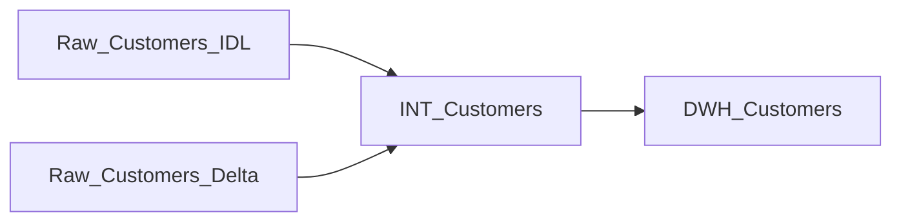

Welcome to your new dbt project! This project is all about creating the snapshots for the customer data using dbt. In this project we are going to perform two loads of the customer data.

- IDL
- Delta

After every load, we are going to generate the snapshot of the customer. In other words we are going to perform the CDC for the customer data. This is how the lineage of our project would look like.

### Using the starter project

Try running the following commands:
- `dbt seed --select customers.idl`
    - This will seed the IDL records for the customers. It'll drop the raw delta entity for the customers if there is any.
- `dbt seed --select customers.delta`
    - This will seed the delta records for the customers. It'll drop the raw IDL entity for the customers if there is any.
- `dbt run --select customers`
    - This will execute the model for customers.
- `dbt snapshot --select customers`
    - This will create the snapshot for the customer.

### Resources:
- Learn more about dbt [in the docs](https://docs.getdbt.com/docs/introduction)
- Check out [Discourse](https://discourse.getdbt.com/) for commonly asked questions and answers
- Join the [chat](https://community.getdbt.com/) on Slack for live discussions and support
- Find [dbt events](https://events.getdbt.com) near you
- Check out [the blog](https://blog.getdbt.com/) for the latest news on dbt's development and best practices

### Seeding the data to raw tables

- `dbt seed --select raw_customers_idl`
    - This will seed the IDL customer data to a raw table. The IDL here stands for Initial Data Load.
    - You can also run the shell job `dbt_seed_customers_delta.sh` which is also available as a part of the same repo.
- `dbt seed --select raw_customers_delta`
    - This will seed the delta or just the changed customer records to the raw table.
    - You can also run the shell job `dbt_seed_customers_delta.sh` which is also available as a part of the same repo.
